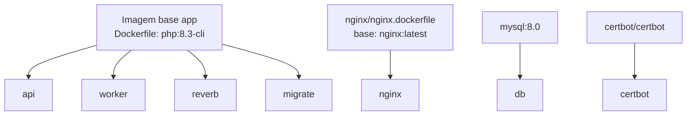

# Estrutura das Imagens Docker

Este documento descreve a estrutura atual das imagens e serviços Docker do projeto, com foco em desenvolvimento e preparação para produção.

## 1. Visao Geral

A stack usa um compose base em `docker-compose.yml` e dois overlays:

- `docker-compose.override.yml`: comportamento de desenvolvimento
- `docker-compose.prod.yml`: comportamento de producao (HTTPS + certbot)

Servicos principais da aplicacao Laravel:

- `api`
- `worker`
- `reverb`
- `migrate`
- `nginx`
- `db`
- `certbot` (somente no overlay de producao)

No ambiente de desenvolvimento atual, o backend compartilha a rede Docker com o frontend (em outro workspace no mesmo host) e publica apenas o `nginx` na porta 80 do host.

## 2. Relacao Entre Imagens



## 3. Imagem Base da Aplicacao (Dockerfile)

Arquivo: `Dockerfile`

Base:

- `php:8.3-cli`

Pacotes instalados:

- `git`
- `unzip`
- `libzip-dev`
- `libpq-dev`
- `supervisor`

Extensoes PHP instaladas:

- `pdo_mysql`
- `pcntl`
- `sockets`

Outros pontos:

- Copia o binario do Composer da imagem `composer:2`
- `WORKDIR` em `/var/www/html`
- Executa `composer install --no-interaction --no-scripts --prefer-dist`
- Expoe portas `8080` e `8081`
- Comando padrao da imagem: `php artisan serve --host=0.0.0.0 --port=8080`

Objetivo:

- Ter uma imagem unica da app para ser reaproveitada por `api`, `worker`, `reverb` e `migrate`, alterando apenas o comando de execucao.

## 4. Servicos Derivados da Imagem da Aplicacao

### 4.1 api

Origem da imagem:

- Build local via `Dockerfile`

Comando:

- `php artisan serve --host=0.0.0.0 --port=8080`

Funcao:

- Servidor HTTP da aplicacao Laravel em ambiente de desenvolvimento.

Dependencia:

- `db` com healthcheck saudavel.

Variaveis relevantes:

- Conexao MySQL apontando para `db`
- `QUEUE_CONNECTION=database`
- `BROADCAST_CONNECTION=reverb`
- Credenciais Reverb (`REVERB_APP_ID`, `REVERB_APP_KEY`, `REVERB_APP_SECRET`)

### 4.2 worker

Origem da imagem:

- Build local via `Dockerfile`

Comando:

- `supervisord -c /var/www/html/docker/supervisor/worker.conf`

Funcao:

- Processamento de filas (jobs) em background com multiplos processos.

Supervisor:

- Arquivo: `docker/supervisor/worker.conf`
- Executa `php artisan queue:work --sleep=1 --tries=3 --timeout=120 --queue=default`
- `numprocs=2` (2 workers concorrentes)

Dependencia:

- `db` com healthcheck saudavel.

### 4.3 reverb

Origem da imagem:

- Build local via `Dockerfile`

Comando:

- `php artisan reverb:start --host=0.0.0.0 --port=8081`

Funcao:

- Servico WebSocket/Broadcast para eventos em tempo real.

Dependencia:

- `db` com healthcheck saudavel.

Observacao importante:

- Precisa das variaveis `REVERB_APP_ID`, `REVERB_APP_KEY` e `REVERB_APP_SECRET` para evitar falha de bootstrap do broadcaster.

### 4.4 migrate

Origem da imagem:

- Build local via `Dockerfile`

Comando:

- `php artisan migrate --force`

Funcao:

- Executar migracoes Laravel como job one-shot.

Comportamento:

- `restart: "no"`
- Sobe, executa migracoes e encerra.

## 5. Imagem do Nginx

Arquivo: `nginx/nginx.dockerfile`

Base:

- `nginx:latest`

Customizacao:

- Copia `nginx/nginx.conf` para `/etc/nginx/nginx.conf`

Servico `nginx`:

- Faz proxy para `api` e `reverb`
- Em dev: usa `nginx/conf.d/dev.conf`
- Em prod: usa templates e certbot para HTTPS
- `restart: unless-stopped`

## 6. Imagem do Banco de Dados

Servico `db`:

- Imagem oficial: `mysql:8.0`

Configuracao:

- `MYSQL_DATABASE` com default `fdo_api`
- `MYSQL_ROOT_PASSWORD` com default `root`
- Healthcheck com `mysqladmin ping`
- Persistencia em volume nomeado `db_data`

## 7. Imagem do Certbot (Producao)

Servico `certbot` (apenas `docker-compose.prod.yml`):

- Imagem oficial: `certbot/certbot`

Funcao:

- Gerenciar/emissao de certificados TLS para o Nginx.

Volumes:

- `certbot-etc:/etc/letsencrypt`
- `./certbot/www:/var/www/certbot`

## 8. Diferencas de Ambiente (Dev x Producao)

### Desenvolvimento (`docker-compose.override.yml`)

- Nginx publicado em `NGINX_HTTP_PORT` (default `80`).
- Bind de `nginx/conf.d/dev.conf` como `default.conf` no container.
- Somente o `nginx` e exposto para o host; `api`, `reverb` e `db` ficam apenas na rede interna/compartilhada.
- O frontend, em outro workspace, e alcancado via nome de servico `frontend` dentro da rede Docker compartilhada.

### Producao (`docker-compose.prod.yml`)

- Nginx publica `80:80` e `443:443`.
- Nginx monta templates para configuracao dinamica.
- Certbot ativo com volume compartilhado de certificados.

## 9. Rede e Volumes

Rede:

- `fdo_network` (external: true)

Rede compartilhada para permitir conexao entre containers do backend e do frontend (em workspaces distintos no mesmo host).

É preciso criar a rede manualmente antes de subir o compose:

```bash
docker network create fdo_network
```

## 10. Regras de Roteamento do Nginx em Dev

Arquivo de referencia: `nginx/conf.d/dev.conf`

- `/app` -> proxy para `reverb:8081` (WebSocket com headers de upgrade)
- `/apps` -> proxy para `reverb:8081`
- `/api` -> proxy para `api:8080`
- `/sanctum` -> proxy para `api:8080`
- `/broadcasting/auth` -> proxy para `api:8080`
- `/` -> proxy para `frontend:80`

Resultado pratico:

- O browser conversa somente com o Nginx do backend na porta publicada.
- O Nginx decide o destino da requisicao (frontend, API Laravel ou Reverb) com base no path.

Volumes nomeados:

- `db_data`: persistencia do MySQL
- `certbot-etc`: certificados TLS do certbot

## 11. Arquivos-Chave da Estrutura

- `Dockerfile`
- `.dockerignore`
- `docker-compose.yml`
- `docker-compose.override.yml`
- `docker-compose.prod.yml`
- `docker/supervisor/worker.conf`
- `nginx/nginx.dockerfile`
- `nginx/nginx.conf`
- `nginx/conf.d/dev.conf`
- `nginx/conf.d/prod.conf.gen-cert`
- `nginx/templates/prod.conf.template`

## 12. Nomes Finais das Imagens Buildadas (Compose)

Com o nome atual do projeto no Compose (`fdo-api`), as imagens locais tendem a ser geradas com estes nomes:

- `fdo-api-api`
- `fdo-api-worker`
- `fdo-api-reverb`
- `fdo-api-migrate`
- `fdo-api-nginx`

Imagens externas usadas sem build local:

- `mysql:8.0`
- `certbot/certbot`
